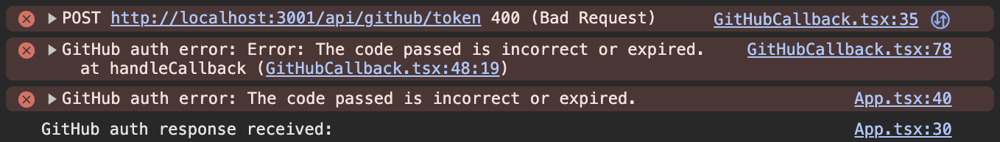

# Minting a PKP with Custom GitHub Auth

This code example demonstrates how to implement custom authentication and authorization using GitHub OAuth. The end result is a PKP that can only be used to sign data if you have valid and recent GitHub OAuth data for a specific GitHub user.

## How it Works

The following is a brief overview of how it works:

1. User clicks the "Login with GitHub" button, which redirects them to GitHub's OAuth flow
2. After authenticating with GitHub, the user is redirected back to the app with an authorization code
3. User clicks the `Mint PKP` button and the Web App requests the user to sign a transaction to mint a PKP using their browser wallet extension
   - As part of the minting PKP transaction, two Auth Methods are permitted for the PKP:
     1. The IPFS CID of the GitHub OAuth Lit Action
        - Granted the ability to sign anything using the PKP
     2. The custom GitHub Auth Method generated by the Web App used to tie the PKP to a specific GitHub user
        - Not granted any signing abilities
4. User clicks the `Get Session Sigs` button and a request is made to the Lit `Datil-test` network to execute the GitHub OAuth Lit Action code
   - The user will be prompted to sign a transaction to mint a Capacity Credit if one wasn't given via an ENV variable
   - The Lit Action only authorizes Session Signatures to be generated for the PKP if the authenticated GitHub user has been permitted to use the PKP
5. User enters a message to sign and clicks the `Sign Data with PKP` button and a request is made to the Lit Datil-test network to sign the message with the minted PKP
6. User clicks the `Verify Signature` button to verify that the signature was created by the minted PKP

## How to Run the Example

### Step 1: Create a GitHub OAuth App

[This](https://docs.github.com/en/apps/oauth-apps/building-oauth-apps/creating-an-oauth-app) is GitHub's guide for creating an OAuth App, and will be the most up to date guide. The following is a brief overview of the steps:

1. Go to your GitHub Settings > Developer Settings > OAuth Apps
2. Click "New OAuth App"
3. Fill in the application details:
   - Application name: Choose any name
   - Homepage URL: Your application's homepage (e.g., http://localhost:3000)
   - Authorization callback URL: Your callback URL (e.g., http://localhost:3000/callback)
4. After creating the app, you'll receive a Client ID and can generate a Client Secret
   - These will need to be added to the `.env` file you'll create in the `server` directory

### Step 2: Configure Environment Variables

Create a `.env` file in the `server` directory using the provided `.env.example` template:

```bash
cp server/.env.example server/.env
```

Add your GitHub OAuth App Client ID and Client Secret to the `.env` file:

```
GITHUB_CLIENT_ID=your_client_id
GITHUB_CLIENT_SECRET=your_client_secret
REDIRECT_URI=http://localhost:3000/callback
```

Create a `.env` file in the root directory using the provided `.env.example` template:

```bash
cp .env.example .env
```

Add your GitHub OAuth App Client ID to the `.env` file:

```
VITE_GITHUB_CLIENT_ID=your_client_id
VITE_GITHUB_OAUTH_SERVER_URL=http://localhost:3001
VITE_REDIRECT_URI=http://localhost:3000/callback
VITE_LIT_NETWORK=DatilTest
VITE_LIT_DEBUG=false
VITE_LIT_CAPACITY_CREDIT_TOKEN_ID=
```

### Step 3: Run the Example

1. Install dependencies:

Install the dependencies for the frontend:

```bash
yarn
```

Install the dependencies for the server:

```bash
cd server && yarn
```

2. Start the server:

In the `server` directory, start the server:

```bash
yarn start
```

3. Start the frontend:

In the root directory, start the frontend:

```bash
yarn dev
```

The frontend will be available at http://localhost:3000

The Ethereum account that you connect to the web app using your browser wallet extension needs to have Lit test tokens. If you don't already have some, you can request some using [the faucet](https://chronicle-yellowstone-faucet.getlit.dev/).

## Exploring the Code

If you'd like to dive deeper into the code to understand how this example works, below is a brief explanation of some of the files you'll want to look at:

- [App.tsx](./src/App.tsx) is the React frontend code for the app.
- [server/server.js](./server/server.js) contains the backend server code for handling GitHub OAuth.
- [GitHubCallback.tsx](./src/GitHubCallback.tsx) handles the OAuth callback from GitHub.
- [GitHubLoginButton.tsx](./src/GitHubLoginButton.tsx) contains the logic for the "Login with GitHub" button.
- [mintPkp.ts](./src/mintPkp.ts) contains the logic for minting the PKP.
- [getPkpSessionSigs.ts](./src/getPkpSessionSigs.ts) contains the logic for requesting Session Sigs using the minted PKP.
- [litAction.ts](./src/litAction.js) contains the Lit Action code
  - The Lit Action is hardcoded to only communicate with the PKP Permission contract deployed on Chronicle Yellowstone at `0x60C1ddC8b9e38F730F0e7B70A2F84C1A98A69167`.
  - It's also hardcoded to only use the Auth Method with the type: `keccak256('Lit Developer Guide GitHub Auth Example')`.
- [pkpSign.ts](./src/pkpSign.ts) contains the logic for signing data with the minted PKP.
- [utils.ts](./src/utils.ts) contains wrapper functions for the Lit SDK.

## Known Issues

After clicking the "Login with GitHub" button, you may see the following error in the browser console:



This can be safely ignored as long as you see `GitHub auth response received:` after the errors. Not sure why it happens, but it doesn't affect the functionality.
